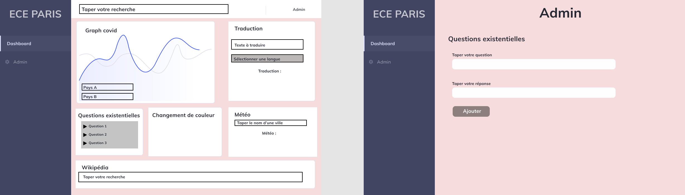

# Projet de fin de semestre - Dashboard 

 Voici notre dashboard réalisé avec React. Nous avons décidé de réaliser un Dashboard présentant plusieurs fonctionnalités que nous estimons pertinentes. 

### Organisation du travail

Afin de correctement réaliser le projet, nous avons divisé le travail avec l'outil Airtable. Vous pouver y accéder en cliquant [ici](https://airtable.com/shrr8Pf4tvyGxhPVU/tblaAcrKzqcAnqfEV)

Ci-dessous un aperçu : 


### Prototypage

Nous avons commencé par créer un premier design de notre Dashboard avec Figma. Nous avons tenté de le rendre le plus simple et intuitif possible. Nous avons réussi à dépasser nos attentes du prototypage lors de la phase de développement puisque le final final est légérement différent des prévisions que nous faites avec Figma.

**Intérêts du prototypage** : Ce prototype nous a permis de définir un squelette à notre Dashboard en pensant au préalable aux différents widgets que nous allons utilisé ainsi qu'à leurs emplacements sur la page. Ceci nous a facilité le travail car, par la suite, nous n'avions plus qu'à les placer dans les espaces dédiés.



### Frontend

Voici la liste des paquets **Yarn** que nous avons utilisés :

- **react-router** : Nécéssaire pour créer notamment le lien entre la page Dashboard et la page Admin.
- **axios** : Nous nous sommes servis d'Axios pour les API de nos widgets **Search** (recherche Wikipédia), **Météo**, **Graph** (Chiffres Covid-19) et **Traduction**.
- **recharts** : Pour l'implémentation du graph Covid-19.
- **react-select** : Pour le comparateur du graph Covid-19.
- **storybook** : composants plus robustes

Nous avons utilisé Bootstrap pour la mise en page de notre Dashboard. De ce fait, notre Dashboard est entièrement responsive.

Nous avons ensuite créer nos **Widgets** (qui sont réutilisables et fonctionnelles) dans un dossier **components**.

Par la suite, il nous suffisait d'intégrer nos widgets dans la page **Dashboard.js** à l'aide de la commande **import**.

### Comment mettre en route notre projet

1) Cloner ce repo.

2) Installer les paquets nécessaires en éxécutant la commande suivante:
    ``` bash
    yarn
    ``` 
    dans **/frontend**

3) Lancer le projet en éxécutant la commande suivante:
    ``` bash
    yarn start
    ``` 
    dans **/frontend**

4) Se rendre sur [localhost](http://localhost:3000/)

## Arian CHAFA - TD2B
## Alexandre HAMELIN - TD2A
## ING 4 - OCRES
